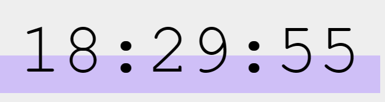

# Reloj Digital

Este es un simple reloj digital creado con JavaScript que muestra la hora actual en formato de 24 horas con segundos.

## Código
let timerPlace = document.querySelector("#timerField");

function timer() {
  let date = new Date();
  let seconds = date.getSeconds();
  let hours = date.getHours();
  let minutes = date.getMinutes();
  timerField.textContent = `${hours}:${minutes}:${seconds}`;
  requestAnimationFrame(timer);
}

timer();
## Vista previa

